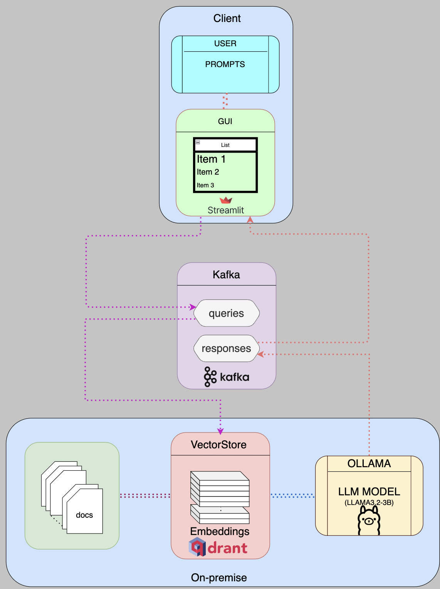

# Qthing - Query Anything / LLM-Based Document QA System

A scalable document question-answering system using locally-hosted LLM (LLAMA3.2), vector search, and a message queue architecture.

## Project Overview

#### Qthing - Query Anything

QThing is an advanced, privacy-first document question-answering system that transforms how you interact with your PDF documents. Powered by cutting-edge local AI/LLM technologies.

#### Key Features

* 🔒 100% Local Processing: No cloud dependencies
* 📄 Semantic PDF Document Search
* 🤖 Retrieval-Augmented Generation (RAG)
* 🚀 High-Performance Local AI Inference
* 📊 Scalable Microservices Architecture

This project implements a document question-answering system with the following components:

* **Ollama** : Runs the LLama-3 language model locally.
* **Qdrant** : Vector database for document storage and similarity search.
* **Kafka** : Message queue for handling query requests and responses.
* **LLama App** : Core application that processes documents and answers queries.
* **Streamlit** : A Python-based framework for building and deploying interactive web applications for data visualization.

The system loads PDF documents, creates vector embeddings, and allows users to ask questions about the document content. It uses a retrieval-augmented generation (RAG) approach to provide accurate answers based on the document context.



## Prerequisites

* Docker and Docker Compose
* NVIDIA GPU with appropriate drivers
* At least 16GB of RAM
* 10GB+ of free disk space

## Project Setup

1. Clone this repository:

```bash
git clone https://github.com/nbkhuong/genai_agent.git
cd genai_agent
```

2. Create necessary directories:

```bash
mkdir -p kafka_data qdrant_data documents models
```

3. Place your PDF documents in the `documents` directory:

```bash
cp your-documents/*.pdf documents/
```

4. Update the Kafka advertised listener in `docker-compose.yml`,  `llama-app.py`, `client_consumer_cli.py`, `client_consumer.py` to match your machine's IP address, e.g.:

```yaml
KAFKA_ADVERTISED_LISTENERS: PLAINTEXT://your-ip-address:9092
```

5. Start the services:

```bash
docker-compose up -d --build
```

## Configuration

### Environment Variables

The following environment variables can be set in the docker-compose.yml file:

* `KAFKA_BOOTSTRAP_SERVERS`: Kafka servers (default: kafka:9092)
* `OLLAMA_SERVER_HOST`: Ollama server address (default: ollama:11434)
* `QDRANT_HOST`: Qdrant server address (default: qdrant:6333)

### Model Configuration

#### Model Selection

By default, the system uses the `llama32-3B-instruct` model, which is hosted at a local computer. To use available from the community or anything else, update the model name in the `main()` function:

```python
llm = OllamaLLM(
    base_url=f"http://{ollama_host}",
    model="your-preferred-model"
)
```

#### How to convert model for local run

1. Download the llama3.2-3B-instruct model weights from huggingface.
2. Create a file named `docker-comModelfile` in models/ with the following content:

   ```
   FROM /root/.ollama/models/llama32-3B-instruct.gguf
   ```
3. Get into bash of ollama docker image, and run:

   ```
   ollama create [your_model_name]
   ```
4. Still in ollama docker image bash, copy the files to /root/.ollama/models/

### Documents Preparation

At the moment, the system only accepts pdf as standard format. To enrich the vector database with knowledge from certain topics, collect pdf files of your topics of interests and put them in /document directory.

## Usage

### On Host

On host computer, fire up the docker container:

```
docker-compose up -d
```

### Client

On the client computer, to communicate with the LLM via GUI, run:

```
streamlit run client_consumer.py
```

Or to communicate with LLM via command line interface, run:

```
python client_consumer_cli.py
```
